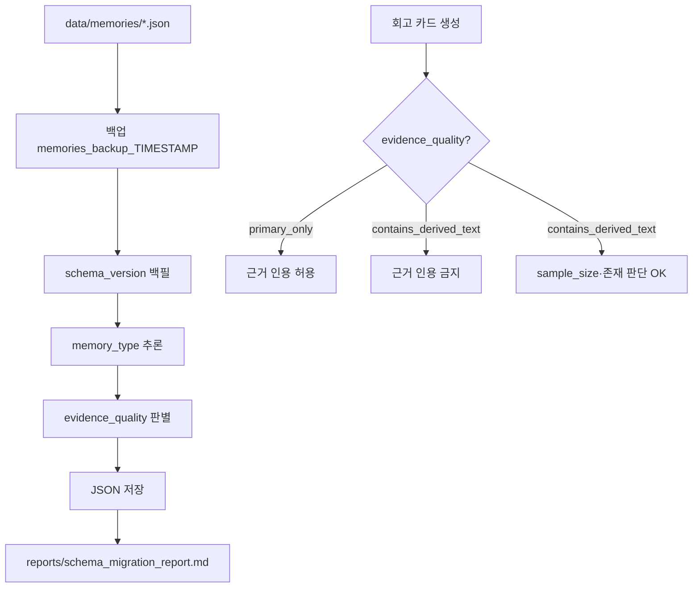

# Memory Schema Migration 설계

> 상태: `superseded` — 구현과 검증이 완료된 스키마 마이그레이션의 과거 설계 기록입니다. 현행 저장 구조는 `../../architecture.md`, 검증 결과는 `../../validation_stage_0_1_decisions.md`를 따릅니다. 격리일: 2026-07-11.

회고 retrieval 신뢰도 향상과 "근거 기반 해설가" 원칙 보호를 위한 마이그레이션 설계 문서.

**현재 상태 (2026-06-16 기준, 36건)**

| 지표 | 건수 | 비율 |
|------|-----:|-----:|
| schema_version missing | 7 | 19.4% |
| memory_type missing | 13 | 36.1% |
| legacy schema (v1) | 4 | 11.1% |
| derived text 의심 (v1 memory_candidate) | 4+ | — |

---

## 1. 목표

1. 모든 메모에 `schema_version`·`migration_status` 부여
2. `memory_type` + `memory_type_confidence` 백필
3. `evidence_quality` 메타데이터로 retrieval 안전성 확보
4. `contains_derived_text` 메모는 회고 카드 **근거 인용 금지** (존재 판단은 허용)
5. 마이그레이션 리포트로 before/after 추적

---

## 2. 아키텍처



### 모듈 구조

| 모듈 | 역할 |
|------|------|
| `conversation_to_memory/migration/schema.py` | schema_version + migration_status |
| `conversation_to_memory/migration/memory_type.py` | memory_type 추론 |
| `conversation_to_memory/migration/evidence_quality.py` | derived text 탐지 |
| `conversation_to_memory/migration/retrieval.py` | 회고 retrieval 필터 |
| `conversation_to_memory/migration/stats.py` | 통계 수집 |
| `conversation_to_memory/migration/report.py` | 리포트 생성 |
| `scripts/migrate_schema_version.py` | A단계 CLI |
| `scripts/run_memory_migration.py` | A~E 전체 파이프라인 |

---

## 3. A. schema_version migration

### 규칙

`schema_version` 필드가 없으면:

```json
{
  "schema_version": 1 | 2,
  "migration_status": "backfilled"
}
```

- **값 판별**: `detect_schema_version()` — legacy(`summary`/`emotion`) → 1, v2 필드 → 2
- 요구사항의 "schema_version = 1"은 **legacy 메모**에 해당. v2 구조 메모는 2로 백필

### 로그 출력

```json
{
  "migrated_count": 7,
  "skipped_count": 29,
  "migrated_ids": ["2026-06-14_094602", "..."],
  "skipped_ids": ["2026-06-09_223830", "..."]
}
```

### 실행

```bash
.venv\Scripts\python.exe scripts/migrate_schema_version.py
.venv\Scripts\python.exe scripts/migrate_schema_version.py --dry-run
```

---

## 4. B. memory_type backfill

### 추론 규칙 (규칙 기반, GPT 미사용)

| memory_type | 신호 |
|-------------|------|
| **event** | 특정 사건·행동 동사, people 필드, 날짜 ID |
| **observation** | "느꼈/같아/반복/자주" 등 현재 인식·의견 |
| **reflection_seed** | open_questions, "?", "왜/궁금/고민/의미" |

### confidence

| confidence | 조건 |
|------------|------|
| high | 최고 점수 ≥ 2, 2위와 차이 ≥ 2 |
| medium | 점수 차 ≥ 1 또는 최고 ≥ 1 |
| low | 신호 없음 → event 기본값 |

```json
{
  "memory_type": "observation",
  "memory_type_confidence": "medium"
}
```

기존 `memory_type`이 있으면 **덮어쓰지 않음** (confidence = high).

---

## 5. C. retrieval safety metadata

### evidence_quality

| 값 | 조건 |
|----|------|
| `primary_only` | legacy 아님 + memory_candidate 오염 없음 |
| `contains_derived_text` | legacy schema **또는** 아래 탐지 |

### derived text 탐지 (memory_candidate)

1. `is_legacy_schema()` → 무조건 `contains_derived_text`
2. `detect_unsupported_inferences()` — 성장 서사·금지어
3. 의도 패턴: `~하고 싶다`, `~해야겠다`, `깨달았`, `그러므로`
4. 문장 단위 원문 겹침률 < 15%

---

## 6. D. retrieval 필터

회고 카드 생성·검증 시 (`cards.py` + `retrieval.py`):

| evidence_quality | 근거 인용 | 존재·sample_size |
|------------------|-----------|------------------|
| `primary_only` | ✅ | ✅ |
| `contains_derived_text` | ❌ | ✅ |

```python
can_cite_as_evidence(memory)      # False → evidence 항목 거부
can_use_for_existence(memory)     # 항상 True
```

`validate_reflection_card()`에서 `validate_evidence_for_memory()` 호출로 enforcement.

---

## 7. E. migration report

`scripts/run_memory_migration.py` 실행 후 `reports/schema_migration_report.md` 생성.

포함 항목:

- before/after schema_version·memory_type 분포
- evidence_quality 분포
- derived text 비율
- retrieval 영향 (citable / blocked / existence)
- 마이그레이션 ID 목록

---

## 8. Rollback 전략

### 자동 백업

모든 쓰기 마이그레이션은 실행 전 `data/memories_backup_{timestamp}/`에 전체 복사.

### 롤백 절차

```powershell
# 1. 백업 디렉터리 확인
ls data/memories_backup_*

# 2. 현재 memories 삭제 후 복원
Remove-Item data\memories\*.json
Copy-Item data\memories_backup_20260616_HHMMSS\*.json data\memories\

# 3. 리포트 삭제 (선택)
Remove-Item reports\schema_migration_report.md
```

### 부분 롤백

특정 ID만 복원:

```powershell
Copy-Item data\memories_backup_20260616_HHMMSS\2026-06-09_223830.json data\memories\
```

### dry-run

`--dry-run`으로 쓰기·백업 없이 통계만 확인 후 실행.

### DB 영향 없음

마이그레이션은 `data/memories/*.json`만 수정. SQLite draft·Supabase evaluation 테이블과 무관.

---

## 9. 테스트

```bash
pytest tests/test_schema_migration.py
pytest tests/test_memory_type_backfill.py
pytest tests/test_retrieval_filter.py
```

| 테스트 | 검증 |
|--------|------|
| `test_schema_migration.py` | backfill, migrated_count/skipped_count/ids, dry-run |
| `test_memory_type_backfill.py` | event/observation/reflection_seed 추론 |
| `test_retrieval_filter.py` | evidence_quality, 인용 차단, sample_size 유지 |

---

## 10. 실행 순서 (권장)

```bash
# 1. dry-run으로 영향 확인
.venv\Scripts\python.exe scripts/run_memory_migration.py --dry-run

# 2. 전체 마이그레이션 + 리포트
.venv\Scripts\python.exe scripts/run_memory_migration.py

# 3. 테스트
pytest tests/test_schema_migration.py tests/test_memory_type_backfill.py tests/test_retrieval_filter.py
```

schema_version만 필요하면:

```bash
.venv\Scripts\python.exe scripts/migrate_schema_version.py
```

---

## 11. 알려진 한계

1. **memory_type 추론**은 규칙 기반이라 GPT 추출 품질보다 낮을 수 있음 → `memory_type_confidence: low`로 표시
2. **legacy v1 메모**는 schema 구조상 무조건 `contains_derived_text` — conversation 원문도 카드 인용 불가 (의도적 보수적 정책)
3. v2 메모 중 memory_candidate가 원문 paraphrase인 경우 overlap heuristic으로 false positive 가능

---

## 12. 향후 개선

- [ ] memory_type GPT 재분류 (confidence=low만 대상)
- [ ] legacy v1 → v2 필드 변환 마이그레이션 (별도 PR)
- [ ] retrieval loader 모듈에서 `filter_citable_memories()` 사전 적용
